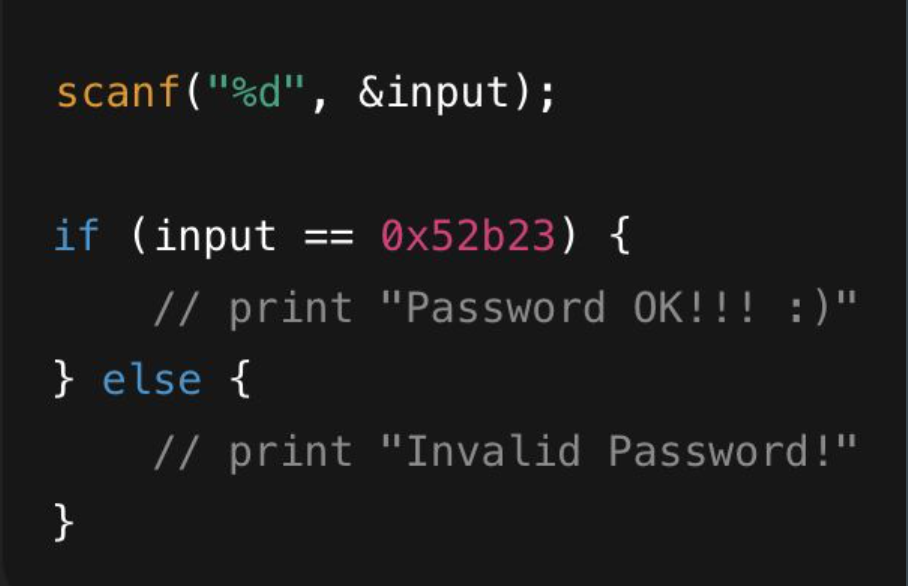
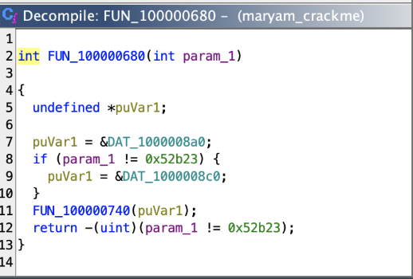
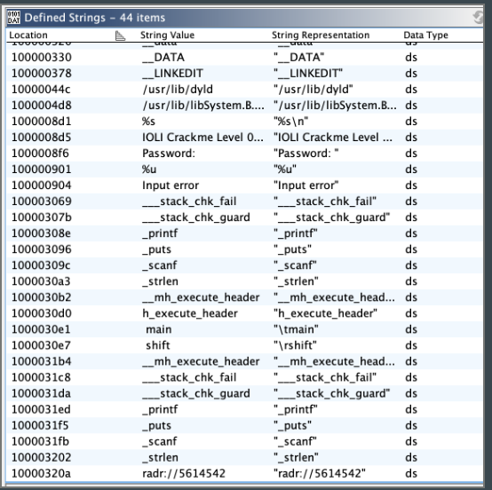
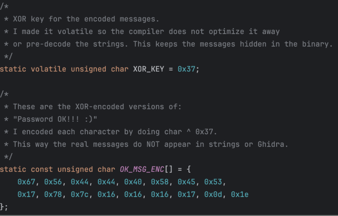
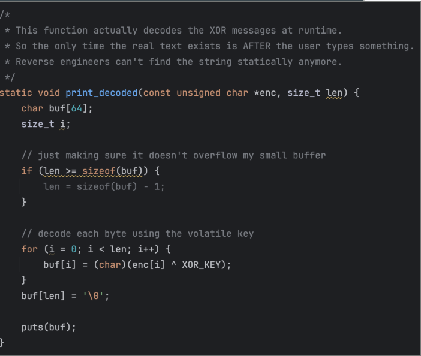
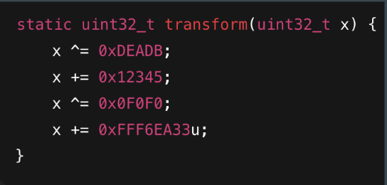
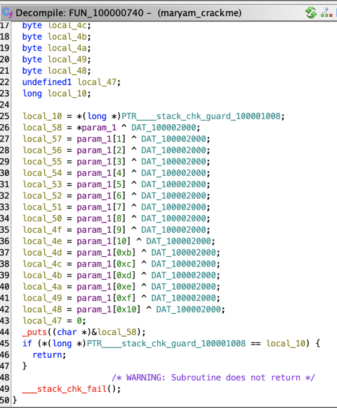

# Reverse Engineering Obfuscation

This project explores how simple CrackMe binaries can be hardened against reverse engineering using string obfuscation, runtime decoding, password logic hiding, and noise code.

The goal was to take an easy-to-reverse CrackMe program and make the important values harder to find in tools like Ghidra, `strings`, and basic debugging workflows.

## Project Goal

The original CrackMe was easy to reverse because:

- The password value was visible in the decompiled code
- Success and failure messages were easy to identify
- Program logic was simple and direct
- There was no meaningful obfuscation or hardening

My goal was to rewrite and harden the program so that the password and output messages were no longer obvious during static analysis.

## Tools Used

- C
- Ghidra
- GCC
- Linux terminal
- `strings`
- `strip`
- Bash

## Techniques Used

## Reverse Engineering Comparison

### Original CrackMe Binary

The original binary exposed important program behavior directly in the decompiled output.

#### Original Main Function


#### Original Password Validation Logic


#### Plaintext Strings Visible in Ghidra


---

### Hardened Binary

The hardened version replaces plaintext values and direct logic with runtime transformations and XOR-based obfuscation.

#### XOR String Obfuscation


#### Runtime Decoding Function


#### Password Transformation Logic


#### Hardened Decompiled Output


### XOR String Obfuscation

The original program stored success and failure messages in a way that was easy to identify. I replaced those messages with XOR-encoded byte arrays.

The messages are decoded only at runtime, which means they do not appear clearly in the compiled binary.

### Runtime Decoding

I created a decoding function that reconstructs the original message only when the program needs to print it.

This makes the binary harder to understand because a reverse engineer has to follow the decoding logic instead of simply reading plaintext strings.

### Password Logic Hiding

The original program compared user input directly against a hardcoded password value.

I replaced the direct comparison with logic that computes or transforms values at runtime, making the password check less obvious in the decompiled output.

### Volatile Keyword

I used `volatile` to help prevent the compiler from optimizing away parts of the obfuscation logic.

This matters because compiler optimization can sometimes simplify or undo defensive code patterns.

### Noise Code

I kept extra unused logic in the program to make the decompiled output more distracting.

This does not make the program impossible to reverse, but it adds friction and makes analysis slower.

## Project Structure

```text
reverse-engineering-obfuscation/
├── README.md
├── CMakeLists.txt
├── src/
│   ├── crackme0x03_base.c
│   ├── crackme0x03_hardened.c
│   └── bruteforce.sh
├── docs/
└── screenshots/
```

## What I Learned

Through this project, I learned that small implementation choices can make a big difference in how easy or difficult a binary is to analyze.

I also learned that obfuscation is not the same as true security. These techniques can slow down reverse engineering, but they do not make a program impossible to analyze.

This project helped me better understand:

- How Ghidra represents program logic
- How plaintext strings can expose program behavior
- How XOR encoding can hide messages from simple string analysis
- How runtime decoding works
- How compiler behavior can affect obfuscation
- Why defenders need to think like reverse engineers

## Future Improvements

Future improvements could include:


- Implementing additional anti-debugging and anti-tampering techniques
- Adding control flow obfuscation to make execution paths more difficult to analyze
- Integrating compiler hardening features such as PIE, RELRO, stack canaries, and stripped symbols
- Automating portions of binary analysis using Python scripting
- Comparing static analysis resistance across multiple obfuscation approaches
- Exploring symbolic execution and constraint-solving techniques against hardened binaries
- Investigating how AI or LLM-assisted workflows could support reverse engineering analysis
- Expanding the project into a larger reverse engineering analysis framework